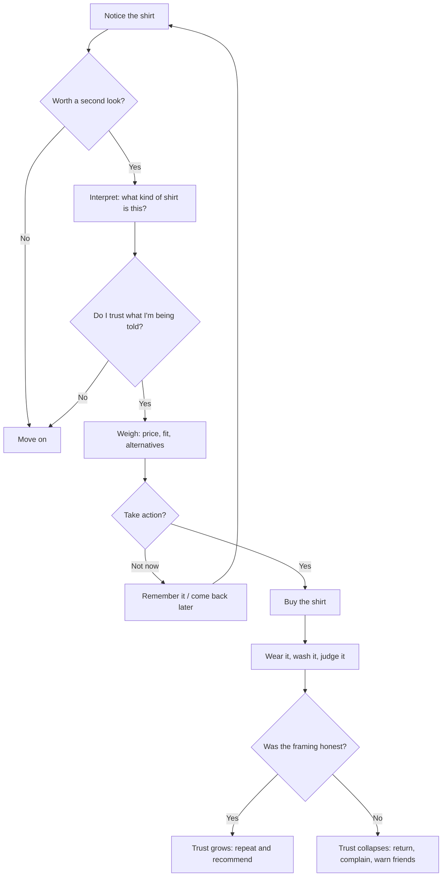

# Chapter 1 — Persuasion and Human Decision-Making

## Start with a shirt

Picture a plain white T-shirt. Cotton, crew neck, no logo, no print. Fold it, put it on a table, and walk away.

Now imagine four versions of the same table:

1. A hand-lettered card that says **"Only 12 left from this batch."**
2. A card that says **"Worn by 3 of the 4 people who work here."**
3. A card that says **"Made in a mill that has been weaving cotton since your grandparents were kids."**
4. A card that says **"Buy two, and we'll give one to a local shelter."**

Nothing about the shirt has changed. The fabric, the stitching, the fit — identical. What changed is the *frame* around it, and with it, how you pay attention to it, how you interpret it, whether you trust it, and whether you reach for your wallet.

That gap between "the thing itself" and "how the thing lands" is where persuasion lives. This chapter is about learning to see that gap clearly, because once you can see it, you can design inside it — and you can also notice when someone is using it on you.

---

## What persuasion actually is

**Persuasion is the deliberate shaping of how someone attends to, interprets, trusts, and acts on something — while leaving them free to decide.**

That last clause matters. Persuasion works *with* a person's ability to choose. It offers reasons, feelings, and context. It does not remove options, hide the ball, or hijack the decision.

It helps to break persuasion into the four things it can influence:

| What persuasion shapes | The question it answers for the audience | White T-shirt version |
|---|---|---|
| **Attention** | "Why should I look at this at all?" | The shirt is on a lit shelf at eye level instead of in a bin. |
| **Interpretation** | "What kind of thing is this?" | "A basic" vs. "a wardrobe foundation" vs. "a blank canvas." |
| **Trust** | "Can I believe what I'm being told?" | A tag that shows exactly where the cotton was grown. |
| **Action** | "What do I do next?" | A clear price, one size chart, and a button that says "Try it." |

Persuasion is not a dirty word. Teachers persuade. Doctors persuade. Friends who talk you out of a bad decision persuade. Designers persuade every time they decide what goes at the top of a page and what goes at the bottom. The question is never *whether* you are influencing people — you always are — but *how*, and *in whose interest*.

---

## Persuasion vs. coercion vs. manipulation

These three get lumped together, and the confusion is convenient for people who would rather not be held accountable. Pull them apart:

| | **Persuasion** | **Coercion** | **Manipulation** |
|---|---|---|---|
| **How it works** | Gives reasons, emotions, or context and lets you decide | Removes or punishes alternatives | Bypasses your reasoning through deception or exploited weakness |
| **Is the person free to say no?** | Yes | No, or only at a real cost | Technically yes — but they don't fully understand what they're saying yes to |
| **Would it still work if fully explained?** | Usually yes | Yes (the threat is the point) | Usually no — exposure kills it |
| **White T-shirt example** | "This cotton is heavier than most, so it holds shape after washing." | "You can't leave the store until you buy something." | A fake countdown timer that resets every time you reload the page. |

A useful gut check is the **transparency test**: *If the person could see exactly what you're doing and why, would they still be okay with it?* Persuasion passes. Manipulation fails. Coercion doesn't even pretend to take the test.

You'll notice the test isn't about *technique*. Scarcity, for instance, can be honest ("we made 200 of these") or manipulative ("we say 'almost gone' on every product, always"). The tactic is the same. The truthfulness and the respect for the other person's judgment are what differ.

---

## Cialdini's principles of influence

Robert Cialdini is a social psychologist whose book *Influence* has been the standard introduction to this topic for decades. He originally described six principles; in later editions he added a seventh, *unity*. Here they are, kept short and honest.

### 1. Reciprocity

People feel obligated to return favors, gifts, and concessions. A free sample, a helpful guide, a sincere compliment — each creates a small, unspoken debt.

*T-shirt:* A store lets you take the shirt home for a week, no card required, and return it if you don't love it. Many people keep it — not just because it's good, but because the store trusted them first.

### 2. Commitment and consistency

Once people commit to something — especially publicly or in writing — they tend to act in ways that stay consistent with that commitment.

*T-shirt:* A brand asks you to pick a "signature fit" during sign-up. Later, when you see "your fit" flagged on a shirt, buying it feels like being yourself rather than being sold to.

### 3. Social proof

When people are unsure, they look to what others — especially similar others — are doing.

*T-shirt:* "Most students at your school who buy basics choose this one." Whether you find that reassuring or slightly creepy tells you a lot about how it's phrased.

### 4. Authority

People defer to credible expertise. Credentials, uniforms, and demonstrated competence all carry weight.

*T-shirt:* A textile engineer explains, in plain language, why the shirt uses long-staple cotton and what that does to pilling. No hype, just competence — and it lands.

### 5. Liking

We say yes more readily to people we like: people who are similar to us, who compliment us, who cooperate with us, and who are familiar.

*T-shirt:* The product page is written by an actual person on the team who admits she used to hate white shirts because they went see-through — and this one doesn't.

### 6. Scarcity

Things seem more valuable when they are rare, limited, or about to disappear. Losing access stings more than gaining it delights.

*T-shirt:* "We cut 300 of these. When they're gone, we make a different one." True scarcity, honestly stated, is persuasive. Fake scarcity is manipulation (see the table above).

### 7. Unity

People are moved by a sense of shared identity — *we*, not just *like me*. Family, hometown, team, movement.

*T-shirt:* A shirt sold only through a campus co-op, with a small tag reading "made for us, by us." The pull isn't the cotton. It's belonging.

---

## Two more ideas worth carrying around

Cialdini's list is about *social* pressure. Here are two other lenses from different fields that a designer should have in the same toolkit.

### Framing and loss aversion (behavioral economics)

Psychologists Daniel Kahneman and Amos Tversky showed that people don't evaluate outcomes in the abstract. They evaluate them *relative to a reference point*, and losses hurt roughly twice as much as equivalent gains feel good. The same fact framed as a loss or as a gain produces different decisions.

*T-shirt, gain frame:* "Save $8 when you buy two."
*T-shirt, loss frame:* "You're paying $8 more per shirt if you only buy one."

Same math. Different feeling. Neither is dishonest, but the loss frame nudges harder, and a designer should know that they are pulling that lever.

Related idea: **defaults.** Whatever option is pre-selected tends to stick, because changing it takes effort and feels like a decision while leaving it doesn't. Pre-checking "add a second shirt" is a tiny design choice with a large behavioral effect — and a real ethical weight.

### Ethos, pathos, logos (rhetoric)

Aristotle's three "appeals" are over two thousand years old and still the fastest way to diagnose why a message isn't working:

- **Ethos** — credibility of the speaker. *Should I trust you?*
- **Pathos** — emotion in the audience. *Do I feel anything?*
- **Logos** — logic and evidence. *Does this make sense?*

Most weak persuasion leans on one and forgets the others. A product page that is all specs (logos) feels cold; one that is all mood photography (pathos) feels empty; one that is all "trusted since 1962" (ethos) feels like it's hiding something.

*T-shirt:* A page that shows the fabric weight in grams (logos), is written by the person who chose that weight and says why (ethos), and includes one photo of the shirt after fifty washes, still white (pathos — quiet relief). All three, in balance.

A closely related idea from communication research, the **elaboration likelihood model** (Richard Petty and John Cacioppo), makes a similar point from the audience's side: when people care and have the capacity to think, they process the *arguments*; when they don't, they lean on *cues* like attractiveness, authority, or how many stars something has. Good designers serve both routes without lying to either.

---

## Principle → mechanism → ethical use → misuse risk

| Principle | Mechanism | Ethical use | Misuse risk |
|---|---|---|---|
| **Reciprocity** | Obligation to return a favor | Give genuine value first (free guide, real trial) | Manufactured "gifts" that create pressure to buy |
| **Commitment & consistency** | Desire to act in line with past commitments | Help people follow through on goals they actually set | Trapping people in small yeses that escalate into big ones |
| **Social proof** | Uncertainty resolved by watching others | Show real usage data from real, similar people | Fake reviews, inflated counts, "trending" that isn't |
| **Authority** | Deference to expertise | Let actual experts explain actual reasons | Costumes of authority: lab coats, jargon, fake credentials |
| **Liking** | Yes flows toward people we like | Be genuinely human, relatable, and honest | Flattery and false intimacy engineered to lower defenses |
| **Scarcity** | Fear of losing access | State true limits plainly | Fake countdowns, perpetual "last chance," artificial stock limits |
| **Unity** | Shared identity motivates action | Build real community around real shared values | Tribal us-vs-them messaging that excludes or inflames |
| **Framing / loss aversion** | Losses weigh more than gains | Make real trade-offs visible and comparable | Loss-framing everything to induce anxiety |
| **Defaults** | Inertia favors the pre-selected option | Default to what most people would choose if they thought about it | Pre-checked add-ons, hidden subscriptions |
| **Ethos / pathos / logos** | Balanced appeals to trust, feeling, and reason | Give people all three so they can decide well | Emotion without evidence; credentials without substance |

---

## A simple decision journey

Persuasion rarely happens in one moment. It happens across a sequence, and each step is a place where a designer makes a choice. Here is a stripped-down version of how someone goes from "never thought about it" to "bought the shirt" — or bounced.

Notice the last branch. Persuasion that oversells creates a short-term sale and a long-term enemy. The shirt doesn't change, but the *memory* of how it was framed does — and that memory shapes every future decision about that brand.

---

## Ethical cautions

A few things to keep in front of you:

- **Technique is neutral; intent and truth are not.** Scarcity, social proof, and framing are all just descriptions of how minds work. The ethics live in whether what you say is true and whether you'd be comfortable with the person seeing your reasoning.
- **Effectiveness is not a defense.** "It converts better" is a fact about outcomes, not a justification. Manipulation often converts better in the short run. That's precisely why it's tempting.
- **Vulnerability raises the bar.** Persuading someone who is tired, stressed, young, grieving, or broke calls for more care, not less. Design that works *because* people are depleted is a red flag.
- **Small levers, big effects.** A default checkbox, a countdown, a pre-filled quantity — these feel trivial to build. They are not trivial in effect. Treat them as decisions, not details.
- **You are also an audience.** The best defense against being manipulated is understanding the mechanisms. Learning this material makes you a better designer *and* a harder target.

---

## Questions to Ask Before Trying to Persuade

Run through these before you ship anything meant to move people:

1. **Is what I'm saying true?** Not "technically true" — true in the way the reader will understand it.
2. **Would this still work if the person could see exactly what I'm doing?** If exposure kills it, it's manipulation.
3. **Am I helping them decide, or deciding for them?** Persuasion leaves the choice intact.
4. **Who benefits if this works — and who bears the cost if they regret it?**
5. **Am I relying on the person being rushed, tired, or confused?** If the design only works under pressure, that's the design's problem.
6. **What is the default, and did I choose it in the user's interest or mine?**
7. **If this person came back a month later, would they feel respected or played?**
8. **Would I be comfortable if this were done to me — or to someone I love?**

If any answer makes you flinch, that flinch is information. Redesign.

---

## Explore Further

No links here on purpose — search these yourself and judge the sources you find:

- `Cialdini Influence principles summary` — for a fuller treatment of the seven principles, including the newer *unity* principle.
- `Cialdini Pre-Suasion` — his later work on what happens *before* a message is delivered.
- `Kahneman Tversky prospect theory framing` — the original research on loss aversion and reference points.
- `elaboration likelihood model Petty Cacioppo` — the central vs. peripheral route to persuasion.
- `dark patterns UX examples` — a catalog of manipulative interface designs, useful as a "what not to do."
- `nudge theory defaults Thaler Sunstein` — how default choices shape behavior at scale, and the debates about whether that's okay.
- `Aristotle rhetoric ethos pathos logos` — the classical foundation for modern persuasion.
- `FTC fake reviews rule` — how regulators treat fabricated social proof.

---

## What You Should Remember

- **Persuasion shapes attention, interpretation, trust, and action — while leaving the person free to choose.** Coercion removes the choice. Manipulation corrupts it.
- **The transparency test is your compass:** would this still work if the person could see exactly what you're doing?
- **Cialdini's seven principles** — reciprocity, commitment/consistency, social proof, authority, liking, scarcity, unity — describe real social forces. Each has an honest form and a manipulative form; the technique is the same, the truth isn't.
- **Framing and defaults** (from behavioral economics) and **ethos, pathos, logos** (from rhetoric) are two more lenses every designer should carry.
- **The white T-shirt never changed.** Everything that changed was in the frame — and that means every frame is a design decision you are responsible for.
